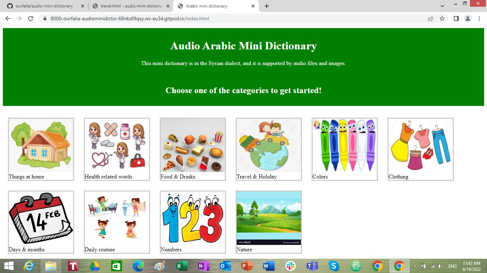

# audio-mini-dictionary

[view the live link here](https://ourfalia.github.io/audio-mini-dictionary/)
 
this website is a mini dictionary of Arabic. The dictionarry is supported by audio files with the Syrian dialect of Arabic. the main page consists of several categories and each one has mnay photos and audio fils.
 

## Features
The website consist of a main page and several sub pages. On the main page, there is a brief introduction and in the body there are different categories. When you click on one of the categories, it takes you to a new page with imags and a clickable audio files attached to each photo. This dictionary contains the most common words.
## Technologies used
1. HTML
2. CSS
3. GIThub 
4. JavaScript
5. free images websites such as free-vectors.net and Fpixabay.com
6. paint 

## Testing 
The W3C Markup validator and W3C CSS validator services were used to validate the pages of the project to ensure that there were no errors in the code. 

[W3C Markup validator results](https://validator.w3.org/nu/?doc=https%3A%2F%2Fourfalia.github.io%2Faudio-mini-dictionary%2F)
[W3C CSS validator results](https://jigsaw.w3.org/css-validator/validator?uri=https%3A%2F%2Fourfalia.github.io%2Faudio-mini-dictionary%2F&profile=css3svg&usermedium=all&warning=1&vextwarning=&lang=en)

Manual testing of all the features of the website was deploied and everything looks fuctioning such as the navigation bar, links and forms.
## Unfixed bugs 
When the website was tested on the W3C validator, it alerted that the images must have "alt" attributes. I did not fix this problem because I run out of time.

## Deployment 
The site was deployed to GitHub pages. The steps to deploy are as follows:
In the GitHub repository, navigate to the Settings tab
From the source section drop-down menu, select the Master Branch
Once the master branch has been selected, the page will be automatically refreshed with a detailed ribbon display to indicate the successful deployment.
The live link can be found here: https://ourfalia.github.io/audio-mini-dictionary/

## Credits
Images were downloaded from free websites such as free-vectors.net and Fpixabay.com

## Acknowledgement
I would like to thank the Code Institute team for their support 